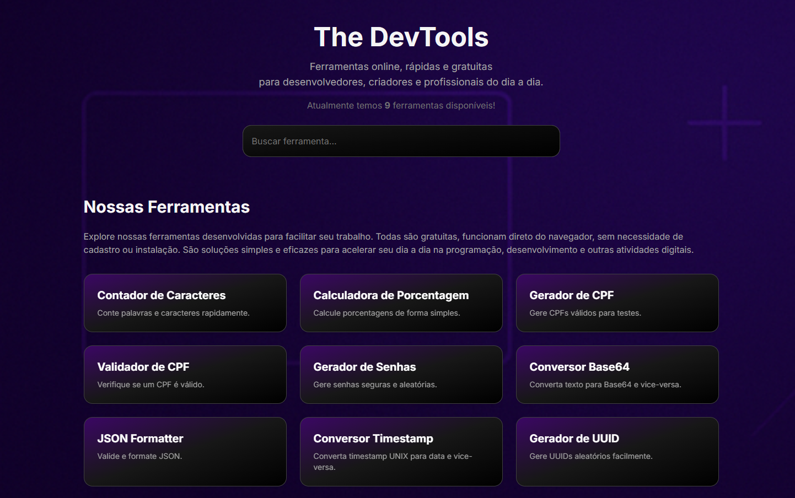

# 🛠️ DevTools

**DevTools** é uma coleção de ferramentas online essenciais para desenvolvedores. O objetivo é centralizar utilidades do dia a dia — como geradores, conversores, validadores e formatadores — em uma única plataforma gratuita, sem anúncios e sem enrolação.

> **Acesse:** [thedevtools.com.br](https://thedevtools.com.br/)

---

## ✨ Funcionalidades

- **Validador de CPF**
- **Gerador de Senha**
- **Conversor Base64**
- **JSON Formatter & Validator**
- **Conversor de Timestamp UNIX**
- **Gerador de UUID**
- E mais!

Novas ferramentas são adicionadas conforme sugestões da comunidade.

---

## 🚀 Demonstração

 <!-- Substitua pelo caminho real do seu print -->

---

## 💡 Por que usar?

- Rápido, leve e responsivo
- Sem necessidade de cadastro
- Privacidade: nada é armazenado nos servidores
- Visual minimalista, otimizado para uso em qualquer dispositivo

---

## 🧑‍💻 Tecnologias

- **Next.js** (React)
- **TypeScript**
- **Tailwind CSS**

---

## 📦 Como rodar localmente

```bash
git clone https://github.com/LHenrique-Marques/devtools-henrique.git
cd devtools-henrique
npm install
npm run dev
```
O projeto estará disponível em [http://localhost:3000](http://localhost:3000).

---

## 🤝 Contribua

Sugestões, correções e novas ferramentas são muito bem-vindas!

1. [Abra uma issue](https://github.com/lhmarquesdev/devtools-henrique/issues) com sua sugestão ou bug encontrado
2. Faça um fork do projeto
3. Crie uma branch (`git checkout -b minha-feature`)
4. Faça o commit (`git commit -m 'feat: minha nova feature'`)
5. Faça o push para o seu fork e abra um Pull Request

---

## 📃 Licença

MIT

---

Desenvolvido por [Henrique Marques](https://www.linkedin.com/in/luis-henrique-marques-508ba126b/)
